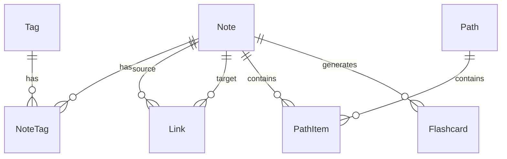

# Grove — Data Model

**Related**: [Grove_prd.md](Grove_prd.md) (scope & requirements), [architecture.md](architecture.md) (stack)
**Last updated**: 2026-09-22 (schema consolidation)

---

## ER Overview

**Relationships**

| Relationship           | Description                                                      |
| ---------------------- | ---------------------------------------------------------------- |
| Note ↔ NoteTag ↔ Tag   | Many-to-many: a note has multiple tags, a tag has multiple notes |
| Note ↔ Link ↔ Note     | Self-referencing many-to-many: notes link to each other          |
| Note ↔ PathItem ↔ Path | Many-to-many: a note can belong to multiple paths                |
| Note ↔ Flashcard       | One-to-many: a note can generate multiple cards (Phase 3)        |

**Core tables**

| Table     | Description                              | Ships in |
| --------- | ---------------------------------------- | -------- |
| Note      | Primary notes table (Seed)               | Phase 1  |
| Tag       | Tags (Species)                           | Phase 1  |
| NoteTag   | Note–tag association                     | Phase 1  |
| User      | User (single-user in v1)                 | Phase 1  |
| Link      | Bidirectional link relationships (Roots) | Phase 2  |
| Path      | Learning paths (Trail)                   | Phase 2  |
| PathItem  | Path entries                             | Phase 2  |
| Flashcard | Review cards                             | Phase 3  |

**ER diagram (Mermaid)**

> If your renderer doesn't support Mermaid, the table above fully covers the relationships.

---

## Phase 1 Tables

These are the tables M1 needs to build. Field-level definitions below were consolidated from PRD §4.2 (Note), §4.4 (Tag/NoteTag) — those sections now just point back here.

### Note (primary notes table)

| Field        | Type      | Description                                                                      |
| ------------ | --------- | -------------------------------------------------------------------------------- |
| id           | bigint    | Primary key                                                                      |
| uuid         | uuid      | Unique identifier                                                                |
| slug         | varchar   | URL-friendly identifier                                                          |
| title        | varchar   | Title, unique (case-insensitive)                                                 |
| content_md   | text      | Markdown source; the source of truth for link relationships                      |
| content_html | text      | Rendered cache; regenerated when the body or a link target (title, slug) changes |
| status       | enum      | draft / published / archived                                                     |
| visibility   | enum      | private / public                                                                 |
| published_at | timestamp | First public-publish time; the blog feed sorts by this; nullable                 |
| created_at   | timestamp | Created time                                                                     |
| updated_at   | timestamp | Updated time                                                                     |
| excerpt      | varchar   | Blog-specific; short summary shown on the blog feed/RSS. Nullable — only set when authored via "New Blog Post" (N-09) |
| cover_image_url | varchar | Blog-specific; header image for the post. Nullable — same as above (N-09)                                        |

**Suggested indexes**:

- Unique index on `uuid`
- Unique index on `slug`
- Unique index on `lower(title)` (for N-07, and the basis for `[[Title]]` resolution)
- Composite index on `(visibility, status, published_at)` (blog feed queries)
- Index on `created_at` (sorting by time)
- Full-text search index: see prd.md §4.5

**Open item — carried from PRD**: no `language` column yet. Once English and Chinese posts genuinely mix in the blog feed, a reader who only reads one language could land on a post in the other with no warning. Consider adding `language` (`en` / `zh`), with an optional per-language filter on the blog feed and RSS. Not urgent for the first few posts — decide before M4 (per progess.md).

### Tag

| Field      | Type      | Description             |
| ---------- | --------- | ----------------------- |
| id         | bigint    | Primary key             |
| name       | varchar   | Tag name                |
| slug       | varchar   | URL-friendly identifier |
| created_at | timestamp | Created time            |

**Suggested index**: unique index on `slug`.

### NoteTag (note–tag association)

| Field   | Type   | Description |
| ------- | ------ | ----------- |
| note_id | bigint | Note ID     |
| tag_id  | bigint | Tag ID      |

**Suggested indexes**:

- Composite primary key on `(note_id, tag_id)`
- Index on `tag_id` (query notes by tag)

### User

PRD §4.11 (Access Control) had requirements (A-01 single-user login, A-02 credentials via env var or first-run setup, A-05 rate-limit failed logins, A-06 change password + session lifetime) with no field-level table ever written down — the old ER overview listed `User` as a core table with nothing behind it. Schema below is now confirmed.

| Field           | Type      | Description                                                          |
| --------------- | --------- | -------------------------------------------------------------------- |
| id              | bigint    | Primary key                                                          |
| username        | varchar   | Login username; unique                                               |
| password_hash   | varchar   | Hashed password (e.g. bcrypt/argon2) — never store plaintext         |
| failed_attempts | int       | Consecutive failed logins, for A-05 rate-limiting; resets on success |
| locked_until    | timestamp | Set when rate-limit threshold is hit; nullable                       |
| created_at      | timestamp | Created time                                                         |
| updated_at      | timestamp | Updated time (e.g. on password change)                               |

**Suggested index**: unique index on `username`.

**Session lifetime (A-06) is deliberately not a column here.** It's handled by ASP.NET Core's cookie auth config (`ExpireTimeSpan` / `SlidingExpiration` in `Program.cs`), not stored in the DB — it's already tracked in the encrypted auth cookie itself, so a DB column would just be a second copy of the same fact. "Configurable" means an appsettings/env value, not a per-request DB read.

---

## Phase 2 / 3 Tables

Link, Path, PathItem, and Flashcard schemas are not needed for M1 and still live next to their requirements in prd.md (§4.3, §4.8, §4.9 respectively). Move them here when Phase 2/3 work starts, following the same pattern as above.
