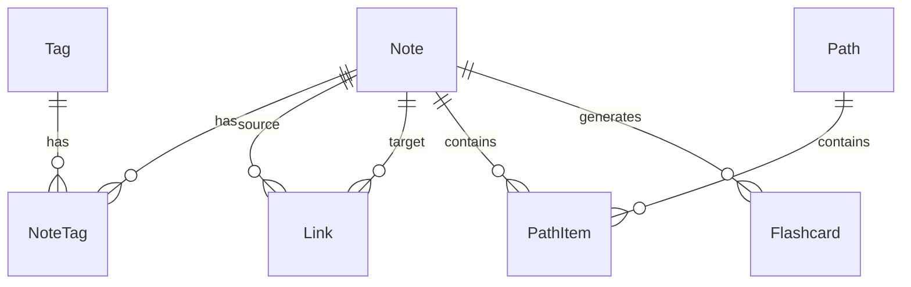

# Grove — Data Model

**Related**: [Grove_prd.md](Grove_prd.md) (scope & requirements), [architecture.md](architecture.md) (stack)
**Last updated**: 2026-09-22

---

## ER Overview

**Relationships**

| Relationship           | Description                                                      |
| ---------------------- | ---------------------------------------------------------------- |
| Note ↔ NoteTag ↔ Tag   | Many-to-many: a note has multiple tags, a tag has multiple notes |
| Note ↔ Link ↔ Note     | Self-referencing many-to-many: notes link to each other          |
| Note ↔ PathItem ↔ Path | Many-to-many: a note can belong to multiple paths                |
| Note ↔ Flashcard       | One-to-many: a note can generate multiple cards (Phase 3)        |

**Core tables**

| Table     | Description                              | Ships in |
| --------- | ---------------------------------------- | -------- |
| Note      | Primary notes table (Seed)               | Phase 1  |
| Tag       | Tags (Species)                           | Phase 1  |
| NoteTag   | Note–tag association                     | Phase 1  |
| Link      | Bidirectional link relationships (Roots) | Phase 2  |
| Path      | Learning paths (Trail)                   | Phase 2  |
| PathItem  | Path entries                             | Phase 2  |
| Flashcard | Review cards                             | Phase 3  |
| User      | User (single-user in v1)                 | Phase 1  |

**ER diagram (Mermaid)**

> If your renderer doesn't support Mermaid, the table above fully covers the relationships.

> **Scope note**: this file currently holds only the ER overview pulled from the old PRD §7. The field-level table definitions (columns, types, indexes — e.g. the Note table, Link table) still live in `Grove_prd.md` §4, next to each feature's requirements (Note table in §4.2, Link in §4.3, Tag/NoteTag in §4.4, Path/PathItem in §4.8, Flashcard in §4.9). Say the word if you'd rather consolidate those here too, so this file is the single complete schema reference.
